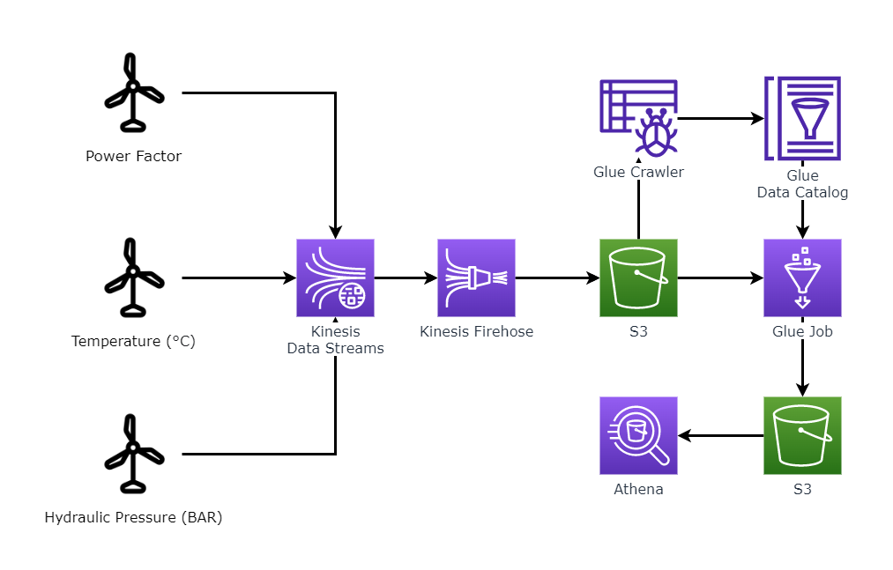

# wind-farm-project
This is my first project in GitHub and in my study carrier of Data Engineer, I hope you enjoy 😄.
 

## Overview

I've made a simulation of a wind farm using python scripts and with AWS I've created a data lake with streaming data of power factor, temperature and hydraulic pressure of the wind turbines.  
All AWS have been used with AWS CLI.  
Follow the diagram project.

 

## Step by step

### AWS Settings

First of all we need to install the AWS CLI.  
To install more easily you can just run the script below in your terminal.
~~~sh
sudo apt install awscli
~~~
For more information about the install visit [documentation of AWS](https://docs.aws.amazon.com/cli/latest/userguide/getting-started-install.html).

Now that you have AWS CLI installed, you need to set up your access key, if you don't have one yet, you can easily create using.
~~~sh
aws iam create-access-key
~~~
The output will be something like this.
~~~json
{
    "AccessKey": {
        "AccessKeyId": "##########",
        "Status": "Active",
        "SecretAccessKey": "###############",
        "CreateDate": "2022-11-21T14:57:52+00:00"
    }
}
~~~
With your access key id and secret access key you will configure your AWS, using.
~~~sh
aws configure
~~~
It's also necessary to put default region name and output format, in doubt use `us-east-1` and `json` respectively.
  

### AWS S3

To create the streaming data we need first one bucket in S3, you can create a new bucket using.
~~~sh
aws s3 mb s3://wind-farm-project
~~~
In wind-farm-project put the name you want to your bucket, remembering that buckets have unique names, so if you try one existing name, you need to change the name, to make sure your bucket was created, use.
~~~sh
aws s3 ls
~~~
And your bucket need to show up in output.
  

### AWS Kinesis

Now it's time to configure the streaming data with Kinesis.  
First use the command below to create the stream in Kinesis.
~~~sh
aws kinesis create-stream --stream-name wind_farm_project
~~~
Now you can view the describe of your Kinesis Data Stream using.
~~~sh
aws kinesis describe-stream-summary --stream-name wind_farm_project
~~~
With our data stream created, we need create the data delivery stream, basically the data delivery will be responsible for delivering all data created by data stream, that in our case will be delivered to s3, specifically for the previously created bucket.  
We're going to do this using Kinesis Firehose.  
But to do this it's necessary a role in IAM. With file trustPolicyFirehose.json avaible in this repository use the command below.
~~~sh
aws iam create-role --role-name firehoseAdminRole --assume-role-policy-document file://trustPolicyFirehose.json
aws iam attach-role-policy --role-name firehoseAdminRole --policy-arn arn:aws:iam::aws:policy/AdministratorAccess
~~~
To make our life easier, we give admin permission to new role created.

With role created, we can finally create the Kinesis Firehose, our data delivery stream.
~~~sh
aws firehose create-delivery-stream --delivery-stream-name wind_farm_project --delivery-stream-type KinesisStreamAsSource --kinesis-stream-source-configuration KinesisStreamARN=arn:aws:kinesis:<your_region_name>:<your_account_id>:stream/wind_farm_project,RoleARN=arn:aws:iam::<your_account_id>:role/firehoseAdminRole --s3-destination-configuration BucketARN=arn:aws:s3:::<your_bucket_name>,RoleARN=arn:aws:iam::<your_account_id>:role/firehoseAdminRole,BufferingHints={IntervalInSeconds=60}
~~~
If you're having error in this command, make sure that your ARN's are right.
  

### Python scripts

Now it'is time to run the python scripts who are in this repository, they will populate our bucket with informations - power factor, temperature and hydraulic pressure - about the wind turbines in wind farm.  
`boto3` is necessary to run the scripts, so if you yet don't have it in your computer it's time to install.  
After we run the python scripts and populate our bucket, will be necessary create parquet files based in this data, for use in our datalake.
  

### AWS Glue

With Glue we will create our data catalog and parquet files.  
First we need create a database in Glue.
~~~sh
aws glue create-database --database-input Name=wind_farm_project
~~~
So now we need the Glue crawler for create our data catalog, but to do this we need create a role with this permission, so, run the command.
~~~sh
aws iam create-role --role-name glueAdminRole --assume-role-policy-document file://trustPolicyGlue.json
aws iam attach-role-policy --role-name glueAdminRole --policy-arn arn:aws:iam::aws:policy/AdministratorAccess
~~~
Using the trustPolicyGlue.json which is in this repository.

Now we can create the crawler.
~~~sh
aws glue create-crawler --name wind_farm_project --role arn:aws:iam::<your_account_id>:role/glueAdminRole --database-name wind_farm_project --targets S3Targets={Path=s3://<your_bucket_name>}
~~~
With the crawler created we need to run it.
~~~sh
aws glue start-crawler --name wind_farm_project
~~~
For view your crawler and status of running, you can run the command.
~~~sh
aws glue get-crawler --name wind_farm_project
~~~
So now we finally will create our parquet files, for later use in datalake.  
For create our parquet files, we need create a job in Glue using.
~~~sh
aws glue create-job --name wind_farm_project --role arn:aws:iam::<your_account_id>:role/glueAdminRole --command Name=glueetl,ScriptLocation=s3://<your_bucket_name>/script/datalake,PythonVersion=3 --glue-version 3.0 --code-gen-configuration-nodes file://configurationNodesJob.json
~~~
Using the configurationNodesJob.json which is in this repository.  
With the job created it'is time to run it.
~~~sh
aws glue start-job-run --job-name wind_farm_project
~~~
You can view your running using.
~~~sh
aws glue get-job-runs --job-name wind_farm_project
~~~
So now we have the parquet files in our prefix datalake in our bucket.  
We can check using.
~~~sh
aws s3 ls s3://<your_bucket_name>/datalake/
~~~
The output must be parquet files.

It's done, now the data is all in parquet and ready to be use in Athena (or any datalake chosen by you).
  
